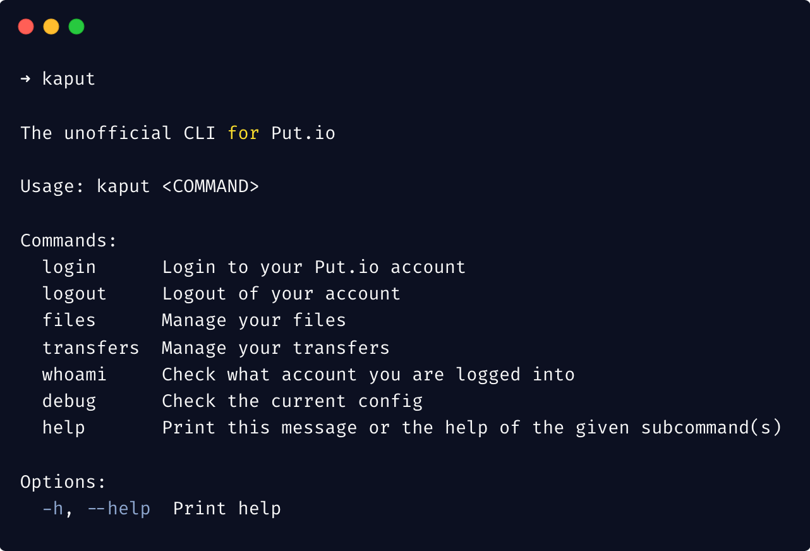
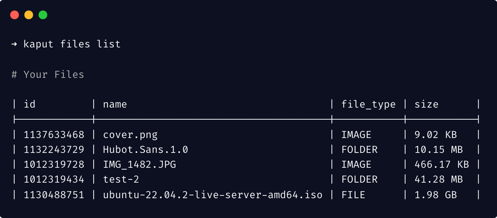
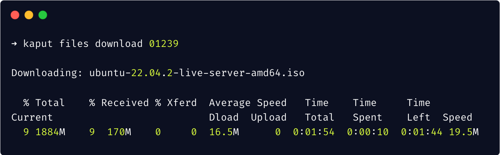

# Kaput-CLI

The unofficial CLI for [Put.io](https://put.io)

[](https://github.com/davidchalifoux/kaput-cli/blob/main/LICENSE)
[](https://crates.io/crates/kaput-cli)

- [Examples](#examples)
- [Features](#features)
- [Installation](#installation)
- [Usage](#usage)

# Examples







# Features

You can use Kaput to _completely_ manage your [Put.io](https://put.io) account from the comfort of your terminal!

### File management

- List all files on your account
- Download any file directly to your computer
- Upload any file directly from your computer
- Delete any file from the terminal
- Move files to different folders
- Rename files
- Extract archives remotely

### Transfer management

- List all transfers on your account
- Add and start new transfers
- Cancel any running transfers
- Retry failed transfers
- Remove old transfers
- Clean your transfers list

# Installation

### Windows, macOS, Linux

Specific instructions coming soon.

### Installing with Cargo

You can directly compile and install Kaput as long as you have [Rust](https://www.rust-lang.org/) and [Cargo](https://doc.rust-lang.org/stable/cargo/) installed on your machine:

1. Install Rust and Cargo (skip if already installed)

```bash
curl https://sh.rustup.rs -sSf | sh
```

2. Install Kaput through Cargo

```bash
cargo install kaput-cli
```

### Manual Installation

Binaries of the latest version of every major platform are available on the [releases](https://github.com/davidchalifoux/kaput-cli/releases/latest) page.

# Usage

Once installed, you can call kaput from the terminal:

```bash
kaput <command>
```

For more information on all of the available commands, refer to our [documentation](https://docs.kaput.sh/commands).
